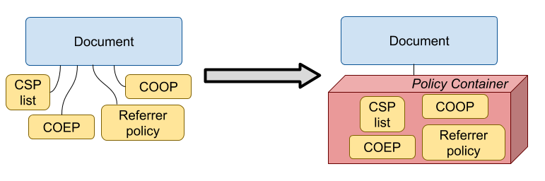
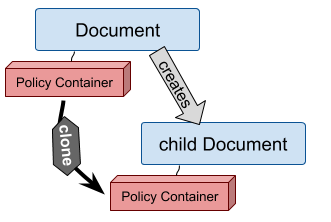
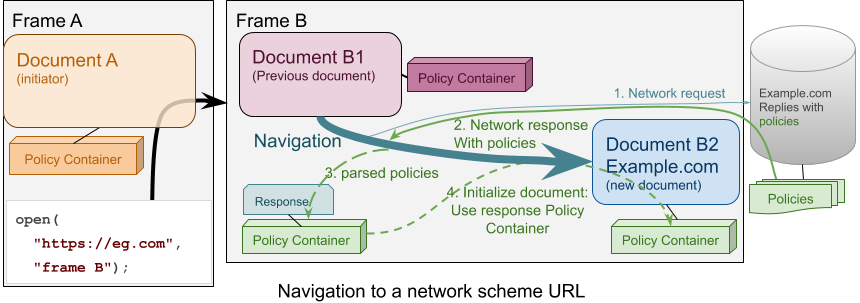
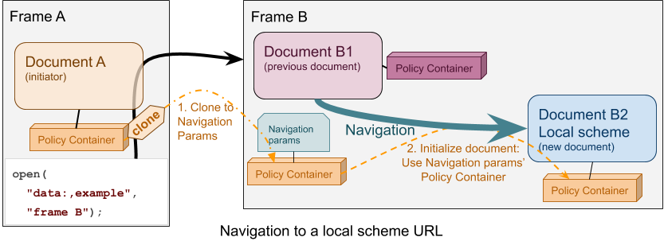

# Policy container explained

[@parismeuleman](https://github.com/ParisMeuleman), [@antosart](https://github.com/antosart) - Dec. 2020

## The problem

The web defines several security policies, among which we count: **Content
Security Policy**, **Cross Origin Opener Policy**, **Cross Origin Embedder
Policy**, **Referrer Policy**. Those policies allow web pages to secure
themselves by restricting dangerous behaviour allowed by default by the web
platform.

These policies are delivered via http headers (and sometimes via html meta tags)
and are enforced on documents. When a document creates a new empty document (or
a srcdoc iframe, a data: url, or a blob), **the policies need to be
inherited**. More generally, this applies to a local-scheme document, which is
not created as a consequence of a network request. At first glance, this might
seem a minor use case, but an improper inheritance offers a straightforward way
to bypass the policies, hence nullifying their purpose.

All policies should have similar inheritance behaviour. Yet **no single
inheritance mechanism is defined in the html spec**. Every security policy must
redefine its own inheritance. This situation generates discrepancies, bugs, and
security vulnerabilities.

Such a crucial inheritance mechanism should be defined once and for all in a
central place.

## A solution: the Policy Container

A proposal was made on [Github](https://github.com/whatwg/html/issues/4926):
Instead of attaching every single policy to the html document, **let's attach to
the html document a policy container** and attach all security policies to that:

The html spec will define the policy container and its lifecycle, while each
policy's specification will use it to store and manage itself.

**The policy container is like a box**, initially empty, **in which you can put
your policy**. The policy container supports a **clone operation**, and each
policy attached to the policy container must define how it behaves with respect
to the clone operation.

Let us now describe the main properties of the policy container.

### Policy container for new documents

Every document gets one policy container at creation time. A document's policy
container is never removed, recreated or reattached, although the values of the
policies can change (this can happen if a policy's value is changed dynamically
via meta tags). The following rules apply to new, **empty documents**:

*   If a new empty document has no creator, it gets a new, default policy
    container.
*   Otherwise, it gets a clone of its creator's policy container.

### Policy container and navigations

*   If a document initiates a
    [navigation](https://html.spec.whatwg.org/multipage/browsing-the-web.html#navigate),
    we store a clone of its policy container in the navigation params (as
    **initiator policy container**).
*   If a navigation resolves to a network scheme, we attach to the response a
    new **response policy container**, which is filled in with the parsed values
    of the various policies (it is the responsibility of each individual policy
    to define how).
*   If a document is the result of a navigation:
    *   If it has a local-scheme URL, it gets the **initiator policy container**
        from the navigation params.
    *   If it has a network-scheme URL, it gets the **response policy
        container** from the response.

## Additional uses of policy container

The policy container will also help better handle two cases in which at the
moment we are not using the corrected policies on a navigated document: history
and blobs.

### Policy container and history

In case of a **history** navigation, it seems natural to reapply the policies
that the document initially came with. For network-scheme documents we don't
need special care here, since we retrieve again the whole data from the network
and in particular we can reparse the policies from http headers and meta
tags. However, for local-scheme documents we should store the policies in
history and reload them. With the policy container, this becomes easier:

*   When creating a history entry, the history entry stores the policy
    container.
*   When navigating to a history entry, the resulting document gets a clone of
    the history entry's policy container.

Notice that we do not need to do anything particular for back-forward-cache
history navigations, since they just display again the document and window which
were saved before, so the exact same policies apply.

### Policy container and blobs

The other case where inheritance is currently problematic is **blob**
documents. Although being a local scheme, inheritance for blob documents should
behave slightly differently. Indeed, a blob should inherit its policies from the
document that creates it. Blobs are persisted and can be reloaded at a later
point in time: we must remember their policies and reapply them. The policy
container makes this easily possible. First, we should add a property for the
policy container in the blob URL entry so that we can store the policy container
in the blob store. Then, we have the following rules:

*   If a document creates a blob, it stores a clone of its policy container as
    part of the blob URL entry in the blob store.
*   When navigating to a blob, we load the blob's policy container from the blob
    URL entry and we apply a clone of it to the resulting document.

## The security policies

The policies that we want to analyze and add to the policy container first are
**[Content Security Policy](https://w3c.github.io/webappsec-csp/)**, **[Cross
Origin Opener
Policy](https://developer.mozilla.org/en-US/docs/Web/HTTP/Headers/Cross-Origin-Opener-Policy)**,
**[Cross Origin Embedder
Policy](https://wicg.github.io/cross-origin-embedder-policy/)**, **[Referrer
Policy](https://www.w3.org/TR/referrer-policy/), [Address
Space](https://wicg.github.io/cors-rfc1918/#address-space)**, **[Document
policy](https://w3c.github.io/webappsec-permissions-policy/document-policy.html)**.

The following table summarizes the inheritance behaviour for those policies:

| Policy                                             | Parent document embeds **empty** or **srcdoc frame** | Document creates **popup**                                       | Navigation to **about:blank** or **data:**                          | Document creates **blob** |
| ------                                             | :--------------------------------------------------: | :------------------------:                                       | :----------------------------------------:                          | :-----------------------: |
| **Referrer policy**                                | Copy from parent                                     | Copy from opener                                                 | Copy from initiator                                                 | Copy from creator         |
| **CSP**                                            | Copy from parent                                     | Copy from opener                                                 | Copy from initiator                                                 | Copy from creator         |
| **COOP**                                           | None                                                 | Copy from opener's top level document if same origin with opener | Copy from initiator's top level document if same origin with opener | Copy from creator         |
| **COEP**                                           | Copy from parent                                     | Copy from opener                                                 | Copy from parent (if any)                                           |                           |
| **Address space**[1](#fn-address-space) | Copy from parent                                     | Copy from opener                                                 | Copy from initiator                                                 | Copy from creator         |
| **Document policy**                                | Copy from parent                                     | Copy from opener                                                 | Copy from initiator                                                 | Copy from creator         |

One word aside for Document Policy: according to the specification, it looks
like there is no inheritance mechanism defined for document policy. However, it
might make sense to apply the same inheritance rules of Content Security Policy
to Document Policy: adding Document Policy to the policy container would be the
good way of doing that.

## Follow-up: Policies enforced on the browsing context

There are some other security policies/properties which include **[Permissions
Policy](https://www.w3.org/TR/permissions-policy-1/)**, **[Sandbox
Policy](https://html.spec.whatwg.org/multipage/iframe-embed-object.html#attr-iframe-sandbox)**,
**[Required CSP](https://w3c.github.io/webappsec-cspee/#csp-attribute),**
**[Required Document
Policy](https://w3c.github.io/webappsec-permissions-policy/document-policy.html#required-document-policy)**,
**[Secure Context](https://w3c.github.io/webappsec-secure-contexts/)** and which
behave slightly differently (or, maybe, in a more complex way) than the policies
we considered above. Roughly speaking, these policies consist of a "required
policy", a "delivered policy" and a "computed policy". The "required policy" is
a property of the browsing context, while the "computed policy", which applies
to the document, is computed "intersecting" the "required policy" and the
"delivered one".

Let us take Sandbox Policy as an example. A browsing context has a "required
policy", as specified by the iframe `sandbox` attribute. A document can itself
deliver some sandbox flags via the Content Security Policy ‘sandbox' directive
("delivered policy"). The final sandbox applied to the document ("computed
policy") is the intersection of the two.

Note that also these policies have inheritance mechanisms. Roughly speaking,
when a document creates a browsing context, the browsing context gets a Clone of
the policy of its creator.

The policies we considered initially for the policy container seem to be a
special case of this general concept, where the "required policy" is always
empty (Content Security Policies of a parent document, for example, do not
enforce anything by default on the Content Security Policy of the child), so
they do not need to attach information to the browsing context.

It looks like a natural second step for the policy container to extend it to
address this more general logic. In particular, we should attach a policy
container to a browsing context and define

1. How a browsing context inherits its policy container from its parent.
2. How to compute the policy container of a document from the policy container
   of its browsing context and the "delivered policy container".

The clone operation of the policy container is just a special case of 2. where
the policy container of the browsing context is null and the "delivered policy
container" is a clone of the initiator's PC (for local scheme documents) or the
result of parsing the http headers (for network requests).

We believe this can be done in a separate second step, after we set the
foundation with the easier case we described above.

## Notes

<a name="fn-address-space">1</a>: Even if the specification does not address
inheritance for local scheme documents, we believe it makes sense to adopt the
same rules as for Content Security Policy. As such, we would like to add address
space to the policy container, too.
